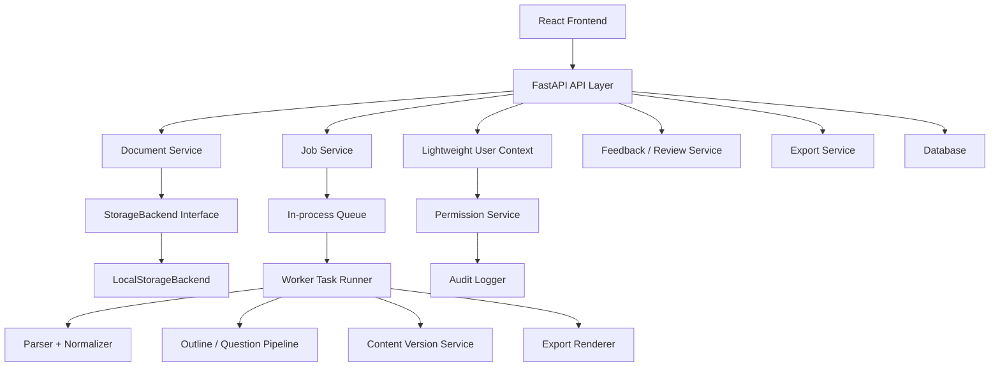

# MVP-7 Internal Beta Product Loop Design

## Purpose

MVP-7 turns the current PPT/PDF study agent from a set of working backend and UI capabilities into an internal-beta product loop. The goal is that a lightweight test user can upload a document, track processing, receive an outline and question set, review versions, submit feedback, create an export, and see the export result. Another user must not be able to access or operate on that user's document, jobs, feedback, or exports.

This phase prioritizes the product loop over deeper RAG experiments, production deployment, or a full authentication system.

## Decisions

- Product direction: formal product loop first.
- Acceptance level: internal-beta usable, not only a local demo.
- Identity model: lightweight multi-user identity through request context, normally `x-user-id`.
- Storage model: `StorageBackend` abstraction with a local backend implementation.
- Job model: database-backed job state plus an in-process queue and worker.
- RAG strategy: keep existing normal RAG, Graph RAG, Agentic RAG, and router capabilities available, but do not make advanced RAG the default product blocker.

## Scope

### In Scope

- Lightweight user context for API and frontend testing.
- Owner-based permission checks for documents, jobs, versions, feedback, review tasks, and exports.
- Storage abstraction for uploads and generated exports.
- Persistent document and job state.
- In-process worker for parsing, normalization, outline generation, question generation, version creation, and export rendering.
- Frontend flow for upload, document list, job detail, outline, questions, versions, feedback, review tasks, and export status.
- Audit events for key product actions.
- Tests for backend services, API routes, database models, worker behavior, and frontend build.

### Out of Scope

- Email/password login, OAuth, SSO, or session management.
- Redis, Celery, RQ, or distributed workers.
- Real S3, MinIO, or external object storage configuration.
- Production deployment, alerting, and CI/CD hardening.
- DSPy, GEPA, or Hermes self-evolution implementation.
- Making Agentic RAG the default production path.

## Architecture

The API and worker must not directly depend on local filesystem paths. They should exchange document and export locations as storage URIs. The local backend is the first implementation of the storage contract, and later S3 or MinIO implementations should be replaceable behind the same interface.

## Component Boundaries

### Frontend

The frontend owns product navigation and user workflow state. It should not implement permission rules, job transitions, storage path construction, or generation logic. It calls API endpoints with a selected or entered lightweight `user_id`.

Expected surfaces:

- User switcher or user input.
- Document upload.
- Document list.
- Job detail with status, progress, error, and retry action.
- Outline view with versions, feedback, and export action.
- Question view with answers, explanations, versions, feedback, and export action.
- Review task view.
- Export status display.

### API Layer

The API layer owns request validation, user context extraction, permission checks, audit event creation, and service orchestration. It should return consistent errors and must not reveal whether a forbidden resource exists.

### Service Layer

Services own business actions:

- Creating document records.
- Creating and retrying jobs.
- Creating content versions.
- Creating feedback and review tasks.
- Creating export jobs.
- Resolving storage URIs through the storage abstraction.

### Worker Layer

The worker owns long-running execution. It reads queued jobs, marks them running, updates progress, writes results, and records failures. Processing and export jobs share the same status vocabulary but execute different handlers.

### Storage Layer

`StorageBackend` owns file persistence and retrieval. Local storage should store uploads under a configured upload root and exports under a configured export root, but callers should only see storage URIs and metadata.

### Database Layer

The database is the source of truth for internal-beta state: documents, jobs, versions, exports, feedback, review tasks, and audit events.

## Data Model

Names can follow the existing SQLAlchemy style, but these semantics are required.

### User Context

`UserContext` is derived from request headers. It is not required to be a persisted user table in this phase.

- `user_id`
- `request_id`

### Document

- `id`
- `owner_id`
- `filename`
- `content_type`
- `source_uri`
- `status`: `uploaded`, `processing`, `ready`, `failed`
- `created_at`
- `updated_at`

### Processing Job

- `id`
- `document_id`
- `owner_id`
- `job_type`: at minimum `process_document`
- `status`: `queued`, `running`, `succeeded`, `failed`, `canceled`
- `progress`
- `error_message`
- `started_at`
- `completed_at`

### Document Artifact

Stores parser-independent normalized output or generated artifacts when needed.

- `id`
- `document_id`
- `artifact_type`
- `content`
- `metadata`
- `created_at`

### Content Version

Content versions must be persisted, not only stored in memory.

- `id`
- `document_id`
- `target_type`: for example `outline`, `question_set`
- `target_id`
- `version`
- `content`
- `metadata`
- `created_by`
- `created_at`
- `change_summary`

### Export Job

- `id`
- `document_id`
- `owner_id`
- `version_id`
- `format`: `markdown`, `json`, and optionally `latex`
- `status`: `queued`, `running`, `succeeded`, `failed`
- `storage_uri`
- `error_message`
- `created_at`
- `completed_at`

### User Feedback

- `id`
- `owner_id`
- `target_type`
- `target_id`
- `rating`
- `reason`
- `comment`
- `created_at`

### Review Task

- `id`
- `owner_id`
- `target_type`
- `target_id`
- `status`: `open`, `resolved`, `rejected`
- `reason`
- `decision`
- `comment`
- `created_at`
- `updated_at`

### Audit Event

- `id`
- `actor_id`
- `action`
- `resource_type`
- `resource_id`
- `request_id`
- `metadata`
- `created_at`

Audit metadata must exclude secrets, raw document content, API keys, authorization headers, and full generated content.

## API Design

All protected endpoints use lightweight user context:

- Required in tests: `x-user-id`
- Optional: `x-request-id`
- Development fallback may use `demo-user`, but tests must cover explicit user isolation.

### Documents

- `POST /api/documents`
  - Upload a PDF or PPT file.
  - Store file through `StorageBackend`.
  - Create `Document` and queued `ProcessingJob`.
  - Return document id and job id.

- `GET /api/documents`
  - Return only documents owned by current user.

- `GET /api/documents/{document_id}`
  - Return document detail and latest job summary.
  - Return 403 for resources not owned by current user.

### Jobs

- `GET /api/jobs/{job_id}`
  - Return job detail if owned by current user.

- `POST /api/jobs/{job_id}/retry`
  - Requeue failed jobs owned by current user.

### Generated Content

- `GET /api/documents/{document_id}/outline`
  - Return latest outline version.

- `GET /api/documents/{document_id}/questions`
  - Return latest question set version.

- `GET /api/documents/{document_id}/versions`
  - Return content version history for the document.

### Feedback and Review

- `POST /api/feedback`
  - Submit feedback on an outline, question, question set, export, or document artifact.
  - Low ratings create an open review task.

- `GET /api/review-tasks`
  - Return current user's visible review tasks.

- `POST /api/review-tasks/{task_id}/decision`
  - Resolve or reject a review task.

### Exports

- `POST /api/exports/{document_id}`
  - Create a queued export job for a content version.

- `GET /api/exports/{export_id}`
  - Return export job status and storage URI when succeeded.

### Health

- `GET /api/health`
  - Return component status for database, queue, storage, and worker readiness where available.

## State Machines

### Document

`uploaded -> processing -> ready`

Failure path:

`uploaded -> processing -> failed`

Retry may move a failed document back to `processing`.

### Processing Job

`queued -> running -> succeeded`

Failure path:

`queued -> running -> failed`

Retry creates or reuses a queued job according to service design, but the API must expose a clear current job.

### Export Job

`queued -> running -> succeeded`

Failure path:

`queued -> running -> failed`

### Review Task

`open -> resolved`

Alternative terminal state:

`open -> rejected`

## Worker Behavior

The in-process worker must support at least two handlers:

- `process_document`
- `export_content`

`process_document` sequence:

1. Load document and source storage URI.
2. Mark job running and document processing.
3. Parse and normalize the document.
4. Generate outline.
5. Generate question set.
6. Persist artifacts and content versions.
7. Mark job succeeded and document ready.
8. On exception, mark job failed, set document failed, and store a safe error message.

`export_content` sequence:

1. Load export job and content version.
2. Mark export running.
3. Render markdown or JSON.
4. Store generated file through `StorageBackend`.
5. Persist `storage_uri`.
6. Mark export succeeded.
7. On exception, mark export failed and store a safe error message.

Startup recovery should identify stale `running` jobs. For MVP-7 it is acceptable to mark them failed with a recoverable error message and allow manual retry.

## Error Handling

- Upload validation failure returns 400 with a stable error code and user-readable message.
- Permission failure returns 403 without exposing resource existence.
- Missing resources owned by the user return 404.
- Parser, generation, and export errors mark jobs failed and preserve a safe `error_message`.
- Storage failures are mapped to typed service errors.
- Worker crashes must not erase job state because job status is persisted.
- Export failure must not affect existing content versions.

## Security and Audit

Owner-based permission checks apply to:

- Document reads and writes.
- Job reads and retries.
- Version reads.
- Feedback creation.
- Review task listing and decisions.
- Export creation and reads.

Audit actions should include:

- document.uploaded
- job.started
- job.failed
- job.succeeded
- content.version_created
- feedback.created
- review_task.created
- review_task.decided
- export.created
- export.failed
- export.succeeded

Audit events must avoid sensitive payloads and full content bodies.

## Frontend Behavior

The frontend should use a consistent user context for all requests. A simple user selector is acceptable for internal beta.

Required views:

- Documents page: upload, list documents, show status, open latest result.
- Job detail page: status, progress, error, retry.
- Outline page: latest outline, version history, feedback, export.
- Questions page: generated questions, answers, explanations, version history, feedback, export.
- Review tasks page: open tasks and decision action.
- Export status: queued, running, succeeded with URI, failed with error.

The UI should stay utilitarian and product-focused. Avoid a marketing landing page.

## Testing Strategy

### Backend Tests

- `StorageBackend` contract and local backend behavior.
- Document service creates document and job records.
- Job service transitions, retry behavior, and owner isolation.
- Worker document processing path creates outline and question versions.
- Export worker renders markdown and JSON through storage.
- Feedback creates review task for low ratings.
- Permission checks deny cross-user access.
- Audit logger redacts sensitive metadata.
- Database models and migrations match ORM fields.

### API Tests

- Upload creates document and queued job.
- Document list only returns current user's documents.
- Cross-user detail, job, export, and version access returns 403.
- Job retry works for failed jobs.
- Latest outline and questions can be fetched after processing.
- Export job creation and status retrieval work.
- Feedback creates a review task.

### Frontend Verification

- `npm run build` passes.
- A smoke test or manually verified local flow covers user selection, upload, job status, outline/questions, feedback, and export status.

### Full Regression

`pytest -q` must pass. Existing `xfail` tests may remain only when they have explicit reasons.

## Acceptance Criteria

MVP-7 is complete when all of the following are true:

1. A user can upload a supported file through the API and frontend.
2. The upload creates persisted document and job records.
3. The worker can process the job into a normalized artifact, outline version, and question version.
4. The frontend can display document status, job status, latest outline, latest questions, and version history.
5. A user can submit feedback, and low ratings create review tasks.
6. A user can create an export job and retrieve the completed export URI.
7. Another user cannot read or mutate the first user's documents, jobs, versions, feedback, review tasks, or exports.
8. Key actions write audit events without sensitive content.
9. Backend tests, API tests, and frontend build verification pass.

## Implementation Task Outline

The implementation plan should split MVP-7 into these tasks:

1. Storage backend abstraction and local backend.
2. Document and job persistence loop.
3. Worker execution for the main product path.
4. Export worker and version download flow.
5. Lightweight multi-user permission and audit integration across API routes.
6. Frontend internal-beta product loop.

Each implementation task must pass the project-required two reviews:

1. Spec review against this design and the implementation plan.
2. Quality review for code quality, naming, edge cases, and test coverage.
