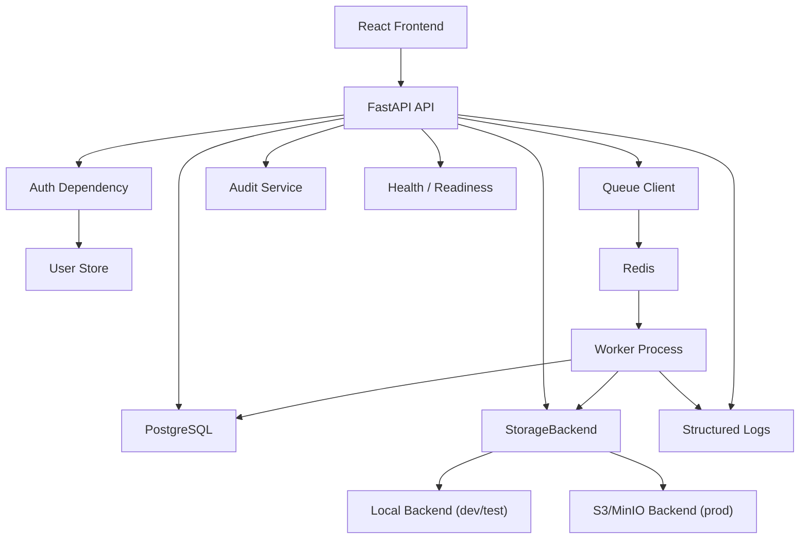

# MVP-8 Production Readiness Foundation Design

## Purpose

MVP-8 moves the PPT/PDF Study Agent from an internal-beta product loop to a production-ready foundation. MVP-7 proved that a user can upload a PPT/PDF, track processing, view generated outline/questions, submit feedback, and create exports. MVP-8 hardens the product boundary around identity, persistence, queueing, storage, deployment, observability, and verification.

This phase intentionally does not make ordinary RAG, Graph RAG, Agentic RAG, or automatic RAG routing the main workstream. Those experiments remain important, but they become MVP-9 once the product has a reliable runtime base.

## Decisions

- Product direction: formal product readiness before deeper RAG experimentation.
- Identity model: replace `x-user-id` as the authority with authenticated users.
- Authorization model: owner isolation remains mandatory; roles are added only where needed for admin/review operations.
- Database model: PostgreSQL becomes the production database target while SQLite remains acceptable for isolated unit tests.
- Queue model: Redis-backed workers replace the in-process queue for production profile.
- Storage model: S3-compatible object storage becomes the production target; local storage remains the default development backend.
- Deployment model: Docker Compose supports separate local and production-like profiles.
- Verification model: CI must run backend tests and frontend build on every push.

## Scope

### In Scope

- User table and authenticated request context.
- Password or token-based login suitable for internal product deployment.
- Short-lived JWT validation in FastAPI dependencies.
- Owner and role-based permission checks for documents, jobs, versions, exports, feedback, review tasks, and audit events.
- PostgreSQL configuration, session factory wiring, and migration workflow.
- Redis-backed queue abstraction and worker process entrypoint.
- S3/MinIO-compatible `StorageBackend` implementation behind the existing storage interface.
- Job reliability hardening: retry, stale-running recovery, idempotent worker guards, safe failure persistence.
- Production-aware Docker Compose profile for API, worker, Postgres, Redis, and MinIO.
- Health and readiness checks for API, database, queue, and storage.
- Structured logging and audit query endpoint for operators.
- GitHub Actions workflow for backend tests and frontend build.
- Product smoke test covering authenticated upload, processing visibility, version access, feedback, export creation, and cross-user denial.

### Out of Scope

- Ordinary RAG / Graph RAG / Agentic RAG automatic routing.
- Billing, payment, subscriptions, or metering.
- Enterprise SSO, OAuth providers, SCIM, or organization management.
- Full admin dashboard.
- Production PDF rendering quality work beyond existing export job reliability.
- DSPy, GEPA, Hermes, or self-evolution implementation.
- Kubernetes, Terraform, or cloud-provider-specific infrastructure.

## Architecture

MVP-8 should preserve the current service boundaries. API routes should stay thin: authenticate, authorize, validate, call services, and record audit events. Services should own business operations. Storage, queue, and database dependencies should be configured through factories or app state so tests can still inject local fakes.

## Component Design

### Auth And User Context

MVP-7 uses `x-user-id` as a lightweight test identity. MVP-8 introduces persisted users and authenticated request context.

Required behavior:

- `UserRecord` stores `id`, `email`, `password_hash` or token credential metadata, `role`, `is_active`, `created_at`, and `updated_at`.
- Login endpoint returns a signed token or session credential.
- API routes derive `UserContext` from the authenticated credential, not from request JSON.
- `x-user-id` may remain only in a test/dev override path controlled by `ALLOW_DEV_USER_HEADER`; it must be disabled when `APP_ENV=production`.
- Inactive users cannot access product APIs.
- Authentication failures return `401`.
- Authorization failures return `403`.

Roles:

- `user`: can operate on owned resources.
- `reviewer`: can view and decide review tasks assigned to them or visible by policy.
- `admin`: can query audit events and health details.

The first implementation can keep roles minimal. It should not build a full organization or tenant model unless the code boundary makes that easy without broad scope expansion.

### Permissions

Permission checks remain owner-first. Existing owner checks for documents, jobs, versions, feedback, review tasks, and exports should be centralized behind a permission service or shared dependency.

Required behavior:

- No API route trusts `owner_id`, `created_by`, or `user_id` from request JSON.
- Cross-user read or mutation returns `403` when the resource exists but belongs to another user.
- Nonexistent resources return `404`.
- Review task visibility is scoped to owner, assignee, reviewer role, or admin role according to explicit policy.
- Audit query endpoints require admin role.

### Database

PostgreSQL is the production database target. SQLite remains supported for unit tests that do not need production database semantics.

Required behavior:

- `DATABASE_URL` configures the production database.
- Alembic migrations create user/auth fields and any new indexes.
- Existing MVP-7 tables remain compatible.
- Tests can still create in-memory SQLite databases with `StaticPool`.
- Application startup fails clearly when production profile has no database URL.

Indexes should support common product queries:

- documents by `owner_id`, `created_at`.
- jobs by `owner_id`, `status`, `document_id`.
- versions by `document_id`, `target_type`, `version`.
- review tasks by `owner_id`, `assignee`, `status`.
- audit events by `actor_id`, `resource_type`, `resource_id`, `created_at`.

### Queue And Worker

MVP-8 replaces the production path for in-process queueing with a Redis-backed queue. The existing in-process queue can remain for tests and local smoke use.

Required behavior:

- Queue interface supports enqueue, dequeue/worker run, retry, and failure recording.
- Worker process can run separately from API.
- Jobs are idempotent by `job_id`.
- A job already completed should not be processed again unless explicitly retried.
- Stale `running` jobs are detected at startup or by a maintenance function and moved to failed/retryable state with a safe error message.
- Queue serialization uses stable task payloads, not Python object closures.
- Worker failures persist `error_message`, status, and timestamp.

### Storage

The existing `StorageBackend` remains the boundary. MVP-8 adds an S3-compatible backend for production.

Required behavior:

- `STORAGE_BACKEND=local|s3` selects backend.
- Local backend remains default for development and tests.
- S3/MinIO backend accepts endpoint URL, bucket, region, access key, secret key, and secure/TLS setting.
- API and workers continue to exchange storage URIs, not local filesystem paths.
- Upload and export paths avoid leaking raw user filenames as object keys without sanitization.
- Storage errors are translated into safe API/worker errors and audit-safe metadata.

### Deployment

Docker Compose should support production-like local deployment.

Required services:

- API
- Worker
- PostgreSQL
- Redis
- MinIO
- Optional frontend static build or dev server profile

Required behavior:

- `.env.example` documents all required production variables.
- Compose health checks ensure API does not report ready until DB, queue, and storage are reachable.
- API and worker use the same database, queue, and storage configuration.
- Local development path remains simple: a developer can still run tests without starting all external services.

### Observability And Audit

MVP-8 should make the system operable before adding more intelligence.

Required behavior:

- Structured logs include request id, user id, route/action, resource ids where safe, job id, and status.
- Health endpoint remains lightweight.
- Readiness endpoint checks database, queue, and storage connectivity.
- Audit events remain sanitized.
- Admin-only audit query endpoint supports filtering by actor, resource, action, and time window.
- Sensitive metadata filtering must continue to exclude raw content, authorization headers, tokens, secrets, passwords, and API keys.

### Frontend

Frontend changes in MVP-8 should support production readiness rather than broad redesign.

Required behavior:

- Login/logout surface.
- Token/session storage with clear logout behavior.
- API client sends authentication credential instead of `x-user-id`.
- User switcher is removed from production UI or hidden behind development mode.
- Unauthorized and forbidden errors have distinct user-facing states.
- Existing document/job/version/feedback/export/review screens continue to work.

## Data Model Additions

### Users

Required fields:

- `id`
- `email`
- `password_hash` or credential hash
- `role`
- `is_active`
- `created_at`
- `updated_at`

Optional but useful fields:

- `display_name`
- `last_login_at`

### Auth Tokens

MVP-8 uses stateless JWT access tokens signed by `SECRET_KEY`. A server-side session table is not required in this phase.

Required token claims:

- `sub`: user id
- `email`: user email
- `role`: user role
- `exp`: expiry timestamp

Refresh tokens, revocation lists, and multi-device session management are deferred until the product needs longer-lived sessions.

## API Changes

New endpoints:

- `POST /api/auth/login`
- `POST /api/auth/logout` is not required for stateless JWT; frontend logout clears the stored token.
- `GET /api/auth/me`
- `GET /api/audit-events` for admin users
- `GET /ready`

Changed behavior:

- Product APIs require authentication.
- `x-user-id` is not authoritative in production.
- Responses for auth failures distinguish `401` from `403`.
- Existing MVP-7 endpoints keep their payload shapes where possible.

## Configuration

Required environment variables:

- `APP_ENV`
- `SECRET_KEY`
- `ALLOW_DEV_USER_HEADER`
- `DATABASE_URL`
- `QUEUE_BACKEND`
- `REDIS_URL`
- `STORAGE_BACKEND`
- `LOCAL_STORAGE_ROOT`
- `S3_ENDPOINT_URL`
- `S3_BUCKET`
- `S3_REGION`
- `S3_ACCESS_KEY_ID`
- `S3_SECRET_ACCESS_KEY`
- `S3_SECURE`

Production profile must fail fast if required production variables are missing.

## Testing Strategy

Backend tests:

- Auth login and `me` endpoint.
- Authenticated document upload.
- Cross-user document/job/version/export denial.
- Reviewer/admin role checks.
- Audit query authorization.
- Redis queue serialization and worker task dispatch with fake Redis or test container if available.
- S3 backend contract tests using MinIO or a fake S3 adapter.
- Stale job recovery.
- Migration smoke test.

Frontend tests or build checks:

- `npm run build`.
- Authenticated API client behavior.
- Login/logout UI state.
- Unauthorized/forbidden state rendering.

Integration smoke:

- Start production-like compose services locally.
- Run a smoke script that logs in, uploads a file, observes job status, creates versions or processes worker, submits feedback, creates export, and verifies cross-user denial.

CI:

- Backend `pytest -q`.
- Frontend `npm ci` and `npm run build`.
- Optional compose smoke can run separately because service startup is heavier.

## Migration And Compatibility

MVP-8 must not break the MVP-7 local test path. The safest migration path is:

1. Add auth models and config while preserving test helper injection.
2. Add authenticated dependencies and keep dev/test override explicitly gated.
3. Add production queue/storage backends behind existing interfaces.
4. Add compose and CI once tests pass locally.
5. Remove user switcher from production frontend after token-based auth works.

Existing tests that use `TestClient(create_app(...))` should be updated intentionally, not accidentally broken. Where a test is unit-level and not about auth, a test auth override can be used.

## Acceptance Criteria

MVP-8 is complete when all of the following are true:

1. A user can log in and call product APIs without `x-user-id`.
2. Cross-user access is denied using authenticated identity.
3. Admin-only audit query exists and is covered by tests.
4. PostgreSQL configuration and migrations are documented and testable.
5. Redis-backed queue path can enqueue and execute product document/export tasks using stable payloads.
6. S3/MinIO storage backend satisfies the same contract as local storage.
7. API, worker, PostgreSQL, Redis, and MinIO run together through Docker Compose production-like profile.
8. Readiness checks fail when database, queue, or storage is unavailable.
9. Frontend login/logout and authenticated API calls work.
10. CI runs backend tests and frontend build.
11. Full backend suite passes.
12. Frontend build passes.

## Risks

- Auth can sprawl into enterprise identity. Keep MVP-8 to local users and signed tokens.
- Queue implementation can overfit to one library. Preserve a small queue interface.
- S3 integration can make tests slow. Use contract tests and local/fake backends where possible.
- Docker Compose can become deployment fiction. Keep it production-like, but do not claim cloud production readiness.
- RAG experiments are tempting but should not enter MVP-8 unless they are needed to validate infrastructure boundaries.

## Open Follow-up: MVP-9

MVP-9 should focus on RAG quality and routing once MVP-8 is stable:

- ordinary RAG, Graph RAG, and Agentic RAG comparison harness.
- automatic routing policy.
- evaluation set management.
- latency, cost, and answer quality metrics.
- per-document/domain routing configuration.
