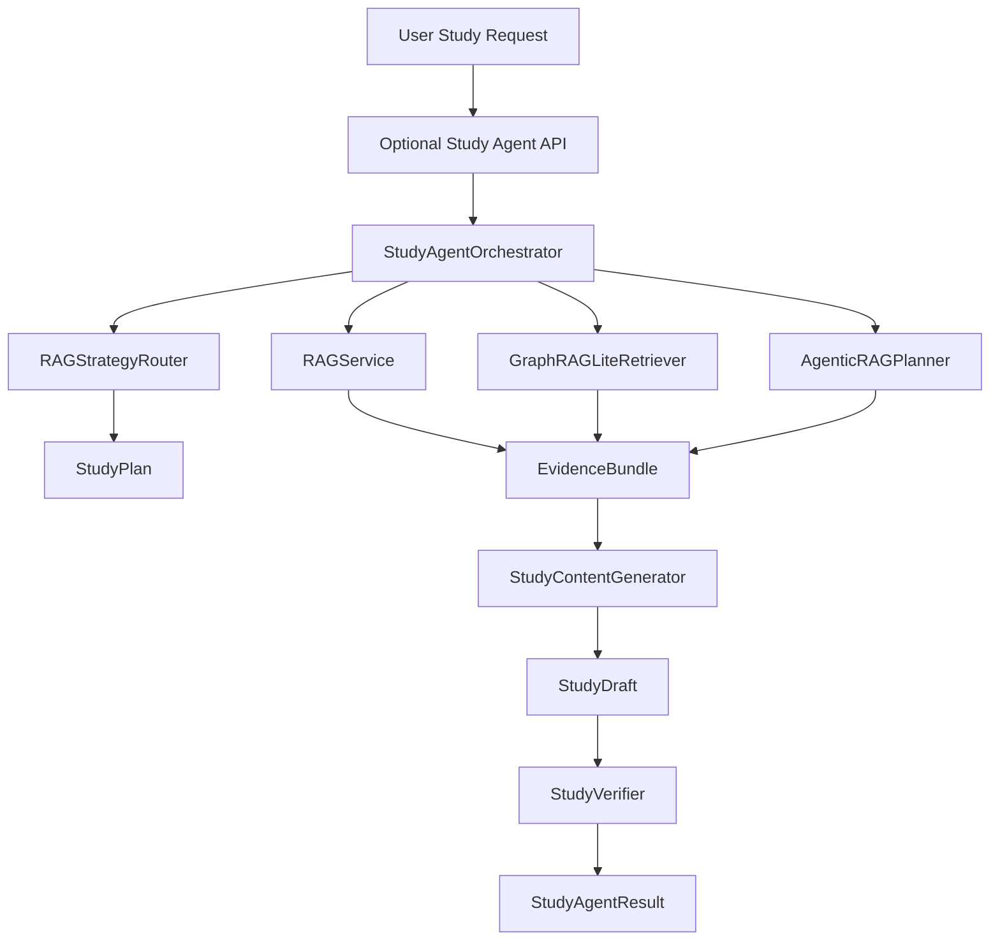

# MVP-9 Agentic Study Pipeline Design

## Purpose

MVP-9 turns the agent layer from a set of deterministic specialist helpers into a traceable study-agent workflow. A user should be able to ask a learning question or request a practice question, and the system should choose an appropriate retrieval mode, gather evidence, generate a grounded response, and self-check the result before returning it.

This phase builds on the MVP-8 production foundation. It does not replace authentication, storage, queueing, or audit behavior. It adds a focused agent orchestration boundary that can later support stronger model providers, richer Graph RAG, and human review workflows.

## Decisions

- Primary direction: build a product-facing Agentic Study Pipeline before deeper model experimentation.
- First implementation style: deterministic, testable, and auditable. Real LLM provider optimization is deferred.
- Entry point: add a service-layer `StudyAgentOrchestrator`; keep the existing `MainCoordinator` and specialist agents intact.
- Retrieval modes: route between `simple_rag`, `graph_rag_lite`, and `agentic_rag`.
- Output standard: every answer, question, or outline fragment must include evidence and verification metadata.
- Safety standard: low-evidence results must be marked for review rather than presented as confident answers.

## Scope

### In Scope

- A study-agent request and result contract for answer, question, and outline-style targets.
- Automatic routing across simple RAG, Graph RAG Lite, and Agentic RAG planning.
- Evidence bundles containing chunks, sources, concept ids, route reason, and confidence.
- A generator boundary that can produce grounded answers, practice questions, and outline fragments from evidence.
- A verifier boundary that checks source coverage, expected term coverage, confidence, and review need.
- Fallback behavior when graph seeds or evidence are missing.
- Service-level tests for routing, evidence collection, verification, and end-to-end orchestration.
- A narrow API route can be added after the service boundary is stable.

### Out of Scope

- Full multi-agent platform infrastructure.
- Hermes self-evolution, DSPy/GEPA optimization, or prompt evolution.
- Enterprise-grade model routing, cost accounting, or provider benchmarking.
- Large-scale vector database or pgvector optimization.
- Full frontend redesign.
- Replacing MVP-8 auth, storage, queue, audit, or worker boundaries.

## Architecture

The orchestrator owns workflow coordination. Retrieval services own evidence recovery. The generator owns content shaping. The verifier owns quality gates. API routes should remain thin: authenticate, authorize, validate, call the orchestrator, and return the result.

## Core Contracts

### StudyRequest

Fields:

- `query`: the user learning question or generation request.
- `target`: `answer`, `question`, or `outline_fragment`.
- `document_ids`: optional scope for allowed documents.
- `preferred_mode`: optional explicit retrieval mode.
- `budget`: `low`, `balanced`, or `high`.
- `expected_terms`: optional terms used by verifier tests and future evaluation sets.

### StudyPlan

Fields:

- `mode`: selected retrieval mode.
- `reason`: route explanation.
- `steps`: ordered plan steps.
- `estimated_cost`: low, medium, or high.
- `fallbacks`: fallback options if the selected path cannot gather evidence.

### EvidenceBundle

Fields:

- `mode`: retrieval mode that produced the evidence.
- `chunks`: retrieved chunks with scores.
- `sources`: unique source identifiers.
- `concept_ids`: related knowledge graph point ids when available.
- `confidence`: evidence confidence.
- `reason`: retrieval explanation.
- `fallback_reason`: optional explanation when a mode fallback occurred.

### StudyDraft

Fields:

- `target`: answer, question, or outline fragment.
- `content`: generated markdown content.
- `citations`: source ids used by the content.
- `used_chunk_count`: number of chunks used.
- `metadata`: safe non-sensitive generation metadata.

### StudyVerification

Fields:

- `passed`: whether the draft can be returned as a normal result.
- `needs_review`: whether human review should be requested.
- `confidence`: final confidence after evidence and draft checks.
- `issues`: list of structured issues.
- `source_recall`: source coverage score.
- `answer_term_recall`: expected term coverage score.

### StudyAgentResult

Fields:

- `request`: normalized request summary.
- `plan`: selected plan.
- `evidence`: evidence bundle.
- `draft`: generated content.
- `verification`: verification result.
- `audit_metadata`: sanitized workflow metadata for audit events.

## Data Flow

1. Normalize and validate the `StudyRequest`.
2. Use `RAGStrategyRouter` unless the request specifies a valid `preferred_mode`.
3. Build a `StudyPlan` with route reason, cost estimate, and fallback options.
4. Retrieve evidence:
   - `simple_rag`: use direct chunk retrieval for definitions and direct lookup.
   - `graph_rag_lite`: match graph seed points, expand neighbors, recover chunks.
   - `agentic_rag`: create a multi-step plan, then gather direct and graph-expanded evidence.
5. If the selected mode cannot gather evidence, apply the configured fallback and record `fallback_reason`.
6. Generate a `StudyDraft` from evidence:
   - `answer`: concise grounded answer with citations.
   - `question`: practice question, answer, explanation, and scoring rubric.
   - `outline_fragment`: structured review notes with source references.
7. Run `StudyVerifier`.
8. Return `StudyAgentResult`. Low-confidence or unsupported results are returned with `needs_review=true`.

## Error Handling And Fallbacks

- Empty query returns a validation error.
- Unknown target returns a validation error.
- No indexed chunks returns an evidence bundle with confidence `0.0`, an explanatory issue, and `needs_review=true`.
- Graph RAG with no seed concepts falls back to simple RAG.
- Agentic RAG with insufficient evidence falls back to graph, then simple.
- Budget `low` prevents high-cost agentic mode unless explicitly requested.
- Generator output without citations fails verification.
- Sensitive metadata must be excluded from audit metadata, following MVP-8 audit sanitization rules.

## API Boundary

The first implementation should prioritize service-layer behavior. After that is stable, add a narrow authenticated endpoint:

- `POST /api/study-agent/query`

Request body maps to `StudyRequest`. Response body maps to `StudyAgentResult`.

The endpoint must use the MVP-8 authenticated user context. It must not trust `owner_id`, `created_by`, or `user_id` from request JSON. Document scoping must use existing owner permissions.

## Testing And Acceptance Criteria

- A definition query routes to `simple_rag`.
- A prerequisite or relation query routes to `graph_rag_lite`.
- A cross-chapter question-generation request routes to `agentic_rag`.
- Graph RAG without seed concepts falls back to simple RAG and records a fallback reason.
- Evidence bundles include chunks, sources, confidence, and retrieval reason.
- Generated drafts include citations when evidence exists.
- Drafts without citations fail verification.
- Requests with no evidence return low confidence and `needs_review=true`.
- Answer and question targets pass service-level orchestrator integration tests.
- Existing MVP-8 verification remains green: backend tests, frontend build, and Docker Compose config.

## Product Notes

This feature should make the agent feel more capable without making the system opaque. The user-facing value is not only the generated answer, but also the trace: why this mode was selected, which sources were used, and whether the system thinks the result needs review.

Frontend work can follow after the service and API contracts stabilize. The first UI improvement should show citations, confidence, and review status near the generated response rather than redesigning the whole product.

## Non-Goals For MVP-9

- No automatic prompt evolution.
- No provider-specific LLM optimization.
- No full admin dashboard for agent traces.
- No new organization or billing model.
- No production-scale vector indexing migration.
- No replacement of the existing document processing pipeline.
