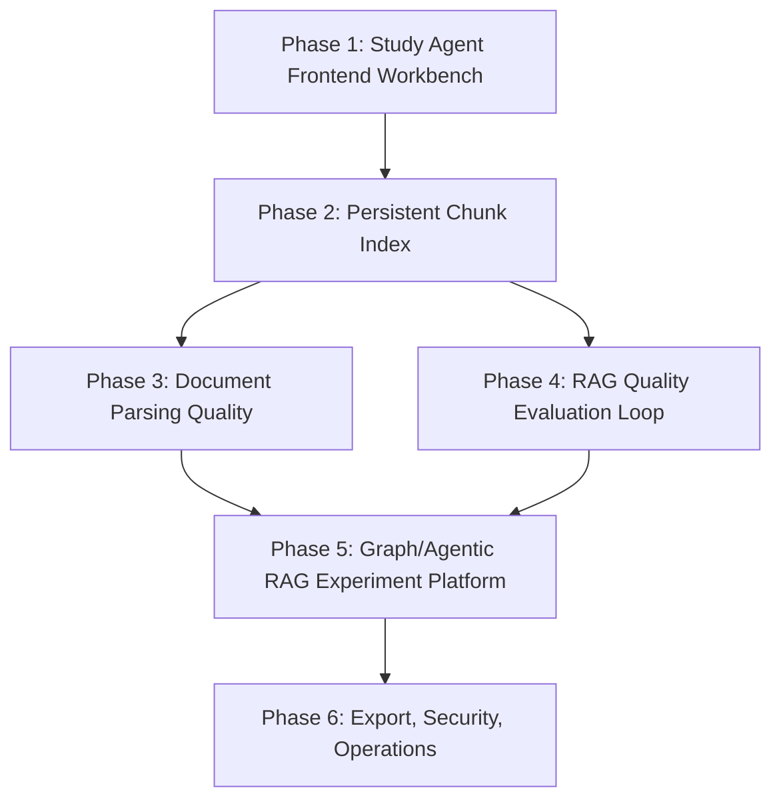

# Product Completion Roadmap Design

## Purpose

This roadmap turns the current PPT/PDF Study Agent from a strong backend foundation into a complete formal product. The current system already has authentication, owner isolation, document processing, storage, queueing, audit events, a frontend workbench, and a Study Agent API that can answer against authenticated users' processed document artifacts.

The remaining work spans multiple subsystems. This roadmap deliberately decomposes P0 and P1 into independent delivery phases so each phase can be specified, planned, implemented, reviewed, tested, and shipped without turning the project into one unreviewable mega-change.

## Product Goal

Users should be able to upload PPT/PDF files, wait for processing, select ready documents, ask the Study Agent grounded learning questions, inspect citations and confidence, generate practice material, export results, and trust that the system is secure, observable, and improving through measured RAG quality feedback.

## Strategy

- Ship product usability before deeper model experimentation.
- Turn temporary query-time indexing into persistent indexing after the frontend workflow proves useful.
- Improve document parsing quality before expecting Graph RAG and Agentic RAG to produce reliably better answers.
- Make RAG experimentation measurable with evaluation data, traces, feedback, and reports.
- Keep safety, owner isolation, audit hygiene, and operational readiness as hard requirements in every phase.

## Phase Overview

The recommended order is Phase 1, Phase 2, Phase 4, Phase 3, Phase 5, then Phase 6. Phase 3 and Phase 4 can partially overlap after Phase 2, but they should not be implemented as one change.

## Phase 1: Study Agent Frontend Workbench

### Goal

Expose the real document-backed Study Agent through the existing frontend so users can complete the core product workflow without calling the API manually.

### Scope

- Add a Study Agent panel or page to the Vite/React frontend.
- Let users select one or more `ready` documents.
- Support Study Agent query parameters:
  - `query`
  - `target`: `answer`, `question`, `outline_fragment`
  - optional `preferred_mode`
  - optional `budget`
  - optional `expected_terms`
- Display:
  - generated content
  - citations
  - evidence chunks or compact source snippets
  - selected retrieval mode
  - confidence and review status
  - fallback reason when present
- Handle product errors:
  - missing document selection
  - document not ready
  - missing processed evidence
  - retrieval miss with `needs_review=true`
  - authentication/session failure

### Likely Files

- `frontend/src/App.tsx`
- `frontend/src/api.ts`
- `frontend/src/types.ts`
- `frontend/src/components/StudyAgentPanel.tsx`
- `frontend/src/components/DocumentSelector.tsx`
- `frontend/src/components/EvidenceViewer.tsx`

### Acceptance Criteria

- A signed-in user can select a ready document and ask a Study Agent question from the frontend.
- The UI shows answer content, citations, mode, confidence, and review status.
- User-facing errors match backend product errors without exposing internal stack traces.
- Existing document upload, job status, versions, feedback, export, and review task workflows remain usable.
- `cd frontend && npm run build` passes.

## Phase 2: Persistent Chunk Index

### Goal

Move from query-time temporary indexing to a persistent product index that can scale, be rebuilt, and support better retrieval experiments.

### Scope

- Add a persistent `document_chunks` model and migration.
- Generate chunks when the worker creates a `normalized_document` artifact.
- Store stable chunk fields:
  - `id`
  - `owner_id`
  - `document_id`
  - `artifact_id`
  - `chunk_index`
  - `chunk_count`
  - `source`
  - `content`
  - `metadata`
  - `content_hash`
  - `created_at`
- Update Study Agent runtime to prefer persisted chunks.
- Keep query-time chunking as a fallback for tests and transition safety during this phase.
- Expose index status so the frontend and operators can see whether a document is indexed, stale, or using fallback indexing.
- Add reindex service behavior and a narrow API route for owned documents.

### Likely Files

- `src/db/models.py`
- `src/db/migrations/versions/*.py`
- `src/services/study_agent_documents.py`
- `src/services/study_agent_runtime.py`
- `src/workers/tasks.py`
- `src/api/routes/documents.py`
- `tests/test_study_agent_documents.py`
- `tests/test_workers_product_flow.py`
- `tests/test_study_agent_runtime.py`

### Acceptance Criteria

- Document processing creates persisted chunks for each ready document with normalized evidence.
- Study Agent can answer using persisted chunks without re-chunking artifacts on every request.
- Owner and document scope remain enforced.
- Reprocessing or reindexing does not leave duplicate active chunks for the same artifact.
- Existing temporary-index behavior remains covered as an intentional fallback path.
- Owned documents can be reindexed through a product API or service call.
- Backend tests pass.

## Phase 3: Document Parsing Quality

### Goal

Improve evidence quality and citation explainability by carrying structural document metadata from parsing through chunks and frontend citations.

### Scope

- Preserve page, slide, section, heading, and block metadata when available.
- Add parsing quality signals:
  - empty extraction
  - very short extraction
  - suspicious character ratio
  - missing text from likely scanned documents
- Extend chunk metadata:
  - `page_number`
  - `slide_number`
  - `section_title`
  - `block_type`
  - `position`
- Improve citation rendering so users see human-readable source context, not only `document:{id}:chunk:{n}`.
- Keep deterministic fallback parsing for tests.

### Likely Files

- `src/parsers/marker_pdf.py`
- `src/normalization/document.py`
- `src/normalization/normalizer.py`
- `src/workers/tasks.py`
- `src/services/study_agent_documents.py`
- `frontend/src/components/EvidenceViewer.tsx`
- `tests/test_document_normalization.py`
- `tests/test_workers_product_flow.py`

### Acceptance Criteria

- Evidence metadata can include page or slide context when available.
- Frontend citations can display document title plus page, slide, or section context.
- Low-quality parsed output is marked for review or repair instead of silently treated as high-quality evidence.
- Existing deterministic worker tests remain stable.

## Phase 4: RAG Quality Evaluation Loop

### Goal

Make RAG quality measurable so routing, indexing, and generation choices can improve based on evidence rather than taste.

### Scope

- Expand evaluation fixture format with:
  - query
  - target
  - document ids or fixture documents
  - expected sources
  - expected terms
  - category
  - optional ideal answer
- Add or extend an evaluation runner for:
  - simple RAG
  - Graph RAG Lite
  - Agentic RAG
- Track:
  - source recall
  - term recall
  - answer coverage
  - latency
  - estimated cost
  - `needs_review` rate
- Produce JSON and Markdown evaluation reports.
- Connect user feedback to evaluation metadata without exposing private content in audit logs.

### Likely Files

- `src/services/rag_evaluation.py`
- `src/services/rag_mode_comparison.py`
- `src/services/feedback_service.py`
- `tests/fixtures/rag_eval_set.json`
- `tests/test_rag_evaluation.py`
- `tests/test_rag_mode_comparison.py`
- `docs/evaluation/`

### Acceptance Criteria

- A fixed evaluation suite can compare simple, graph, and agentic modes.
- Reports show quality, latency, and review-rate differences by mode and query category.
- Evaluation code can run in CI or as a local smoke command without external provider access.
- Feedback records can be linked to study-agent quality analysis without leaking raw content into audit metadata.

## Phase 5: Graph RAG And Agentic RAG Experiment Platform

### Goal

Turn Graph RAG and Agentic RAG from isolated capabilities into controlled, observable product experiments.

### Scope

- Make route decisions structured:
  - query type
  - selected mode
  - reason
  - confidence
  - estimated cost
  - fallback chain
- Persist or expose safe study-agent traces:
  - selected mode
  - evidence count
  - source count
  - fallback reason
  - latency
  - `needs_review`
- Improve Graph RAG:
  - concept aliases
  - neighbor expansion limits
  - concept-to-chunk recovery through persisted chunk metadata
- Improve Agentic RAG:
  - explicit plan steps
  - multi-hop retrieval
  - self-check
  - deterministic fallback behavior
- Use evaluation results to tune routing thresholds.

### Likely Files

- `src/services/rag_router.py`
- `src/services/graph_rag.py`
- `src/services/agentic_rag.py`
- `src/services/study_agent.py`
- `src/services/rag_evaluation.py`
- `src/db/models.py`
- `src/api/routes/audit.py`
- `tests/test_rag_router.py`
- `tests/test_graph_rag.py`
- `tests/test_agentic_rag.py`
- `tests/test_study_agent_orchestrator.py`

### Acceptance Criteria

- Every Study Agent query can explain why a retrieval mode was selected.
- Graph and agentic failures have stable fallback behavior.
- Evaluation reports can show whether advanced modes outperform simple RAG for targeted query categories.
- Owner and document scope remain enforced across all retrieval modes.

## Phase 6: Export, Security, And Operations

### Goal

Close formal-product gaps around export workflows, security controls, and operational readiness.

### Scope

Export:

- Export Study Agent answers, practice questions, and outline fragments.
- Include citations and review metadata in Markdown/JSON exports.
- Prepare PDF export templates after Markdown output is stable.

Security:

- Add refresh token or session renewal strategy.
- Add rate limiting and upload size enforcement.
- Enforce content type and file extension allowlists.
- Document secret rotation and production key requirements.
- Tighten audit/admin access if needed.

Operations:

- Add structured logging for API, worker, and Study Agent requests.
- Add metrics for request latency, worker jobs, RAG mode, review rate, and error rate.
- Document backup and restore expectations for database and object storage.
- Extend release docs with production checklist and troubleshooting.

### Likely Files

- `src/api/routes/exports.py`
- `src/services/export_service.py`
- `src/security/auth.py`
- `src/security/audit.py`
- `src/config.py`
- `src/observability/`
- `src/api/app.py`
- `docs/release/DEPLOYMENT.md`
- `docs/release/OPERATIONS.md`
- `tests/test_export_service.py`
- `tests/test_mvp8_auth.py`
- `tests/test_observability.py`

### Acceptance Criteria

- Users can export Study Agent results with citations.
- Basic abuse controls exist for request rate, upload size, and file type.
- Operational docs explain required secrets, backup expectations, and readiness checks.
- Observability captures enough metadata to debug Study Agent quality and runtime failures without logging private content.

## Non-Goals

- No enterprise SSO in these phases.
- No billing, subscriptions, or organization-level tenant administration.
- No managed cloud deployment automation such as Terraform or Kubernetes manifests.
- No provider-specific LLM optimization until deterministic evaluation is in place.
- No large-scale vector database migration until persistent chunk indexing has proven useful.

## Recommended Next Spec

The next implementation spec should be Phase 1 only:

`docs/superpowers/specs/YYYY-MM-DD-study-agent-frontend-workbench-design.md`

Phase 1 is the highest-leverage next step because the backend document evidence path now works, but users still need a polished product surface to use it. After Phase 1 ships, Phase 2 should make the retrieval path scalable with persisted chunks.
