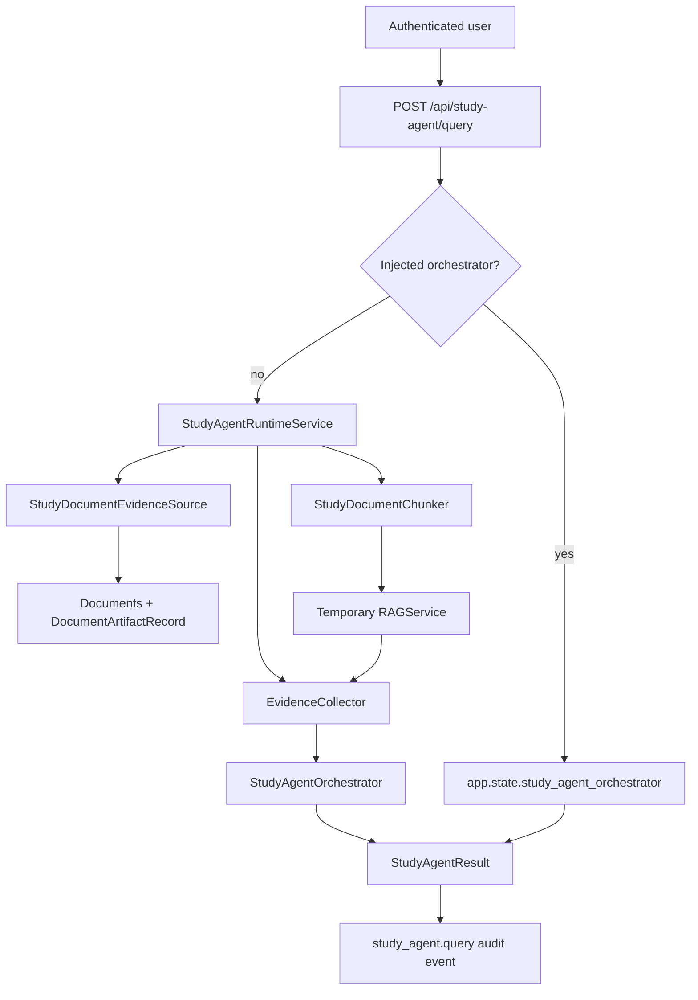

# Study Agent Document Evidence Integration Design

## Purpose

This phase turns the MVP-9 Study Agent from an injectable orchestration surface into a product-ready document study workflow. A signed-in user should be able to query the Study Agent against their own processed PPT/PDF documents and receive a grounded answer, practice question, or outline fragment with citations, verification status, and audit metadata.

The immediate implementation uses query-time temporary indexing. It deliberately avoids a persistent chunk table, external vector database, or broad frontend redesign. Those are later scale and experience improvements; this phase proves the end-to-end product path from uploaded document artifact to grounded Study Agent result.

## Decisions

- Primary direction: wire the Study Agent to real processed document artifacts before adding more agent experiments.
- Indexing approach: build a temporary in-memory `RAGService` per request from owner-scoped document artifacts.
- Document scope: `document_ids` are required in the first product version. Missing `document_ids` is a validation error.
- Evidence source: prefer the latest `DocumentArtifactRecord` with `artifact_type="normalized_document"`.
- API behavior: preserve explicit `app.state.study_agent_orchestrator` injection for tests and development; use the new runtime service as the default product path.
- Retrieval modes: reuse the existing automatic routing across simple RAG, Graph RAG Lite, and Agentic RAG.
- Safety standard: authorization and document readiness failures return explicit product errors; weak retrieval from otherwise valid documents returns `needs_review=true`.

## Scope

### In Scope

- Owner-scoped loading of processed document artifacts for Study Agent requests.
- Deterministic query-time chunking of normalized document content.
- Stable chunk source identifiers and metadata that preserve document ownership and future persistent-index compatibility.
- A product runtime service that builds a temporary `RAGService`, `EvidenceCollector`, and `StudyAgentOrchestrator` per request.
- API wiring so `/api/study-agent/query` works without a manually injected orchestrator when a database-backed runtime is available.
- Product errors for missing document scope, unauthorized documents, non-ready documents, and missing normalized artifacts.
- Tests for real artifact retrieval, permission isolation, validation behavior, default API runtime behavior, and injected orchestrator compatibility.
- Documentation of the future persistent-index migration path.

### Out of Scope

- Adding pgvector, a managed vector database, or a persistent chunk index in this phase.
- Rebuilding the document processing worker pipeline.
- Replacing `RAGStrategyRouter`, `EvidenceCollector`, `StudyContentGenerator`, or `StudyVerifier`.
- LLM provider optimization, prompt evolution, or new model benchmarking.
- Large frontend redesign or multi-document discovery UI.
- Organization-level permissions, billing, quotas, or admin analytics.

## Architecture

The API remains thin. It authenticates the user, injects request context, chooses the runtime path, records sanitized audit metadata, and returns the JSON result. The new runtime owns real document evidence loading and temporary index construction. Existing study-agent components continue to own planning, retrieval mode execution, generation, and verification.

## Components

### StudyDocumentEvidenceSource

`StudyDocumentEvidenceSource` reads document evidence from the product database. It depends on `session_factory`, not FastAPI state.

Inputs:

- `owner_id`: authenticated user id from request context.
- `document_ids`: explicit document ids from the request.

Responsibilities:

- Reject an empty document id list before querying evidence.
- Load only documents where `Document.id` is requested and `Document.owner_id` equals `owner_id`.
- Avoid leaking whether another user's document exists. Requested ids that are missing from the owner-scoped result are reported as inaccessible document ids.
- Require every loaded document to have `status == "ready"`.
- Select the newest `DocumentArtifactRecord` with `artifact_type == "normalized_document"` for each document.
- Return document evidence records containing document id, title, owner id, artifact id, artifact content, artifact metadata, and artifact timestamp.

Failure semantics:

- Empty `document_ids`: validation error.
- Requested document not owned by the authenticated user or not found in the owner scope: inaccessible document error.
- Document exists but is not `ready`: document not ready error.
- Ready document lacks a normalized artifact: missing document evidence error.

### StudyDocumentChunker

`StudyDocumentChunker` converts loaded artifacts into deterministic chunk dictionaries accepted by `RAGService.index_chunks`.

Chunk requirements:

- Chunk content is non-empty normalized text.
- Source format is `document:{document_id}:chunk:{chunk_index}`.
- Metadata includes:
  - `owner_id`
  - `document_id`
  - `document_title`
  - `artifact_id`
  - `artifact_type`
  - `chunk_index`
  - `chunk_count`
  - `source_kind="normalized_document"`
- Chunk boundaries are deterministic and independent of request query.
- Default chunking uses `max_chars=900` and `overlap_chars=120`. The implementation can expose these as constructor arguments for tests and future tuning, but the product default must remain deterministic.

The chunker does not perform authorization, database access, or retrieval. Its output is intentionally close to the future persistent-index row shape.

### StudyAgentRuntimeService

`StudyAgentRuntimeService` is the default product runtime for Study Agent queries.

Responsibilities:

- Normalize request payload only after API context has injected `authenticated_user_id` and `request_id`.
- Require `authenticated_user_id`.
- Load document evidence through `StudyDocumentEvidenceSource`.
- Chunk artifacts with `StudyDocumentChunker`.
- Build a fresh `RAGService` and index chunks for the request.
- Construct `EvidenceCollector` and `StudyAgentOrchestrator`.
- Run the orchestrator and return `StudyAgentResult`.

The service should keep constructor dependencies explicit:

- `session_factory`
- optional `graph_factory` or `KnowledgeGraph` provider for later graph-backed runtime support
- optional generator, verifier, router, and retrieval configuration overrides for tests

The initial implementation does not require a graph provider. When no graph is configured, existing Graph RAG and Agentic RAG fallback behavior to simple RAG remains valid.

## API Behavior

Endpoint:

- `POST /api/study-agent/query`

Runtime selection:

1. Read authenticated user context using existing request middleware.
2. Build payload from allowed request fields.
3. Inject `authenticated_user_id` and `request_id`.
4. If `request.app.state.study_agent_orchestrator` is present, use it exactly as today.
5. Otherwise, use `request.app.state.study_agent_runtime_service` when available.
6. If no runtime service exists but `session_factory` is configured, create or lazily attach the default `StudyAgentRuntimeService`.
7. If neither orchestrator nor runtime prerequisites exist, return `503`.

Validation:

- Blank query remains a request validation error.
- Missing or empty `document_ids` returns `422`.
- Unsupported `target`, `budget`, or `preferred_mode` remains `422`.
- Unknown request fields remain ignored by the existing Pydantic request model; identity fields from JSON are never trusted.

Response:

- Successful requests return `StudyAgentResult` in the existing JSON shape.
- Audit metadata remains sanitized and includes at least mode, target, review flag, source count, chunk count, and document count.

## Data Flow

1. User uploads a PPT/PDF and the product worker processes it.
2. Worker persists `DocumentArtifactRecord(artifact_type="normalized_document")` and marks the document `ready`.
3. User calls `/api/study-agent/query` with `query`, `target`, and explicit `document_ids`.
4. API injects authenticated context.
5. Runtime source loads owner-scoped ready documents and normalized artifacts.
6. Chunker creates deterministic chunks with ownership and document metadata.
7. Runtime indexes chunks into a fresh in-memory `RAGService`.
8. Existing Study Agent orchestration chooses simple, graph, or agentic retrieval.
9. Evidence collector enforces chunk-level `owner_id` and `document_id` filtering.
10. Generator creates the answer, question, or outline fragment.
11. Verifier marks unsupported or low-confidence output as needing review.
12. API records a sanitized `study_agent.query` audit event and returns the result.

## Error Handling

Errors should be specific enough for product UX and tests while avoiding cross-user data leakage.

- Missing `document_ids`: `422`, with a message that the Study Agent requires explicit document selection.
- Inaccessible document ids: `404`, with a non-leaking message that the selected document is unavailable to the current user.
- Document not ready: `422`, with a message that the document must finish processing before Study Agent can use it.
- Missing normalized artifact: `422`, with a message that processed document evidence is unavailable.
- No chunks after chunking: `422`, because this indicates unusable processed evidence rather than a retrieval miss.
- Retrieval miss against valid chunks: return a normal `StudyAgentResult` with zero or low confidence, verification issues, and `needs_review=true`.
- Database/runtime unavailable: `503`.

The service should use typed domain exceptions or a small error-code object rather than parsing arbitrary strings in the route.

## Security And Privacy

- Never accept `owner_id`, `user_id`, or `created_by` from request JSON.
- All document loading is scoped by authenticated user id.
- Chunk metadata must carry `owner_id` so the existing `EvidenceCollector` scope filter remains effective.
- Audit metadata must not include query text, document content, chunk text, artifact content, or secrets.
- Inaccessible document errors must not disclose whether a document id exists for another user.
- The injected orchestrator path remains a developer/test escape hatch and should not bypass API authentication.

## Testing And Acceptance Criteria

- A request with a ready document and normalized artifact returns a grounded result using sources shaped like `document:{document_id}:chunk:{index}`.
- Chunk metadata includes `owner_id`, `document_id`, `artifact_id`, and `chunk_index`.
- A request without `document_ids` returns `422`.
- A request for another user's document returns `404` and cannot use that document as evidence.
- A request for an owned but non-ready document returns `422`.
- A request for a ready document with no normalized artifact returns `422`.
- A retrieval miss from valid chunks returns `needs_review=true` rather than a runtime error.
- The API works without `app.state.study_agent_orchestrator` when `session_factory` is configured.
- The API still supports an explicitly injected orchestrator for tests and development.
- Existing Study Agent service tests remain green.
- Full backend tests, frontend build, and Docker Compose config remain green before landing implementation.

## Phase B: Persistent Index Migration

Phase B should migrate the same chunk model into a persistent index. The worker would create chunks when document processing completes, store chunk rows or vector records, and mark index freshness relative to document artifacts. Query-time retrieval would then filter by `owner_id` and requested `document_ids` before retrieval or at retrieval time.

The Phase A metadata contract is intentionally shaped for this migration. A future persistent index should preserve:

- stable `source`
- `owner_id`
- `document_id`
- `artifact_id`
- `chunk_index`
- `chunk_count`
- artifact/source kind

Phase B should also add reindexing, stale-index detection, chunk versioning, and observability for retrieval latency and index coverage.

## Non-Goals For This Phase

- No persistent vector search.
- No graph database migration.
- No automatic indexing background job beyond the existing normalized artifact creation.
- No new frontend document picker flow.
- No user-visible multi-agent trace redesign.
- No provider-specific LLM behavior changes.
